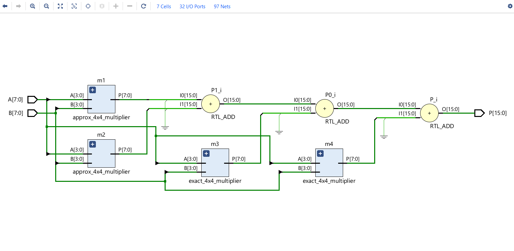
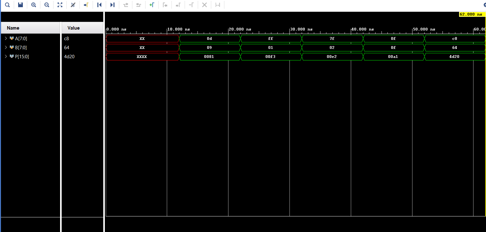

# Approximate 8×8 Multiplier using a One-Gate 4:2 Compressor

This project implements a hardware-efficient approximate 8×8 multiplier designed for low-power and error-tolerant applications such as image processing, machine learning, and embedded systems. The design reduces hardware complexity by using a simplified one-gate approximate 4:2 compressor and a structured 4×4 multiplier block that is scaled to form the complete 8×8 architecture.

---

##  Key Features

- **One-Gate Approximate 4:2 Compressor**
  - Very low logic complexity  
  - Outputs:  
    - `Sum = 0`  
    - `Carry = X2 OR X4`  
    - `Cout` ignored to reduce hardware  
- **4×4 Approximate Multiplier Block**
  - Partial products encoded using generate & propagate logic  
  - Reduced using approximate compressors, half adders, and full adders  
- **8×8 Multiplier Construction**
  - Built using four 4×4 blocks  
  - Two blocks operate exactly, two operate approximately  
  - Achieves a balance between efficiency and accuracy  

---

##  Hardware & Error Results (Your Design)

Evaluation performed after synthesis and simulation.

| Parameter | Value |
|----------|--------|
| **LUT Usage** | **55** |
| **Delay** | **17.012 ns** |
| **Power** | **87 mW** |
| **Error Rate (ER)** | **3.149%** |
| **MRED** | **0.00180** |
| **NMED** | **1.538 × 10⁻⁵** |
| **PRED** | **1.227%** |

Results for image merging application.

| Parameter | Value |
|----------|--------|
| **PSNR** | **46.32 dB** |
| **SSIM** | **0.9994** |

---

##  Architecture Overview

### 🔹 Approximate 4:2 Compressor
A minimal-logic compressor that produces:
- **Constant sum output**
- **Carry based only on selected inputs**
- **No carry-out propagation**

This keeps the design power-efficient and FPGA-friendly.

### 🔹 4×4 Approximate Multiplier
- Generates 4×4 partial products  
- Converts them to generate/propagate signals  
- Reduces them via approximate compressor + conventional adders  
- Produces an approximate 8-bit result

### 🔹 8×8 Multiplier
The full 8×8 multiplier is formed by combining four 4×4 blocks:
- Two exact blocks → preserve accuracy  
- Two approximate blocks → reduce hardware

---

##  Simulation & RTL Diagrams

### RTL Schematic

### Simulation Waveform

